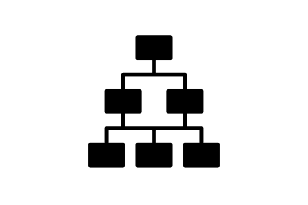

# Documento de Casos de Uso

## Lista dos Casos de Uso

 - [CDU 01](#CDU-01): Cadastro de Pacientes.
 - [CDU 02](#CDU-02): Cadastro de Médicos.
 - [CDU 03](#CDU-03): Login de Pacientes/Médicos.
 - [CDU 04](#CDU-04): Agendamento de Consultas.
 - [CDU 05](#CDU-05): Vizualização de Perfil.
 - [CDU 06](#CDU-06): Vizualização de Calendário/Grade Horária.

## Lista dos Atores

 - Administrador
 - Médico
 - Paciente

## Diagrama de Casos de Uso

## Descrição dos Casos de Uso

### CDU 01

Quisque id neque a erat imperdiet dictum et ut mauris.

**Fluxo Principal**

1. Paciente insere nome completo.
2. Paciente insere CPF.
3. Paciente insere data de nascimento.
4. Paciente insere telefone.
5. Paciente insere email.
6. Paciente insere senha.
7. Paciente finaliza cadastro.
8. Sistema analisa as informações.
9. Sistema registra dados.

**Fluxo Alternativo A**

1. Pellentesque id mauris id ex fringilla iaculis.
2. Maecenas ut dui at sapien rhoncus porttitor in sed turpis.
3. Maecenas fringilla augue id sodales volutpat.
4. Nulla vehicula lectus eu eros faucibus porta.
5. Morbi non sem in diam dictum aliquet sit amet at metus.
6. Aenean dictum diam in tempus ornare.

**Fluxo Alternativo B**

1. Ut elementum dolor id lorem elementum, et condimentum eros laoreet.
2. Nulla sollicitudin arcu nec suscipit volutpat.
3. Aliquam mattis sapien nec ornare faucibus.
4. Sed eu massa nec enim condimentum commodo at eget ligula.
5. Nam ultricies velit nec erat feugiat condimentum.
6. Nam vitae lacus porttitor, sodales orci vel, lobortis arcu.

### CDU 02

Morbi fringilla dolor at mattis vestibulum.

**Fluxo Principal**

1. Admnistrador insere nome completo.
2. Admnistrador insere CRM.
3. Admnistrador insere especialidade.
4. Admnistrador insere telefone.
5. Admnistrador insere email.
6. Admnistrador insere senha.
7. Admnistrador finaliza cadastro.
8. Sistema analisa as informações.
9. Sistema registra dados.

**Fluxo Alternativo A**

1. Nulla elementum diam eu elementum rutrum.
2. Aenean scelerisque est at nunc ornare, ac condimentum justo sollicitudin.
3. Quisque eget risus ut est lacinia sollicitudin ac non diam.
4. Quisque ac nulla convallis, lobortis nibh ac, tristique enim.
5. Nulla ultricies metus nec risus mollis, interdum ultrices justo malesuada.

### CDU 03

Duis nec orci quis velit faucibus hendrerit tempus vel libero.

**Fluxo Principal**

1. Usuário insere CPF/CRM.
2. Usuário insere senha.
3. Usuário finaliza login.
4. Sistema analisa as informações.
5. Sistema libera acesso.

**Fluxo Alternativo A**

1. Aliquam efficitur arcu ac fermentum egestas.
2. Pellentesque ac diam vitae erat bibendum hendrerit.
3. Mauris sed purus sit amet lectus efficitur placerat et eu diam.
4. Aenean ullamcorper tellus quis nibh porttitor congue.
5. Phasellus laoreet erat eget condimentum dictum.

### CDU 04

Duis nec orci quis velit faucibus hendrerit tempus vel libero.

**Fluxo Principal**

1. Praesent interdum lectus sit amet augue tincidunt imperdiet.
2. Duis ac dolor vel nisi imperdiet vehicula et non sem.
3. Nunc imperdiet tortor consequat, lobortis purus non, interdum risus.

**Fluxo Alternativo A**

1. Aliquam efficitur arcu ac fermentum egestas.
2. Pellentesque ac diam vitae erat bibendum hendrerit.
3. Mauris sed purus sit amet lectus efficitur placerat et eu diam.
4. Aenean ullamcorper tellus quis nibh porttitor congue.
5. Phasellus laoreet erat eget condimentum dictum.

### CDU 05

Duis nec orci quis velit faucibus hendrerit tempus vel libero.

**Fluxo Principal**

1. Praesent interdum lectus sit amet augue tincidunt imperdiet.
2. Duis ac dolor vel nisi imperdiet vehicula et non sem.
3. Nunc imperdiet tortor consequat, lobortis purus non, interdum risus.

**Fluxo Alternativo A**

1. Aliquam efficitur arcu ac fermentum egestas.
2. Pellentesque ac diam vitae erat bibendum hendrerit.
3. Mauris sed purus sit amet lectus efficitur placerat et eu diam.
4. Aenean ullamcorper tellus quis nibh porttitor congue.
5. Phasellus laoreet erat eget condimentum dictum.

### CDU 06

Duis nec orci quis velit faucibus hendrerit tempus vel libero.

**Fluxo Principal**

1. Praesent interdum lectus sit amet augue tincidunt imperdiet.
2. Duis ac dolor vel nisi imperdiet vehicula et non sem.
3. Nunc imperdiet tortor consequat, lobortis purus non, interdum risus.

**Fluxo Alternativo A**

1. Aliquam efficitur arcu ac fermentum egestas.
2. Pellentesque ac diam vitae erat bibendum hendrerit.
3. Mauris sed purus sit amet lectus efficitur placerat et eu diam.
4. Aenean ullamcorper tellus quis nibh porttitor congue.
5. Phasellus laoreet erat eget condimentum dictum.

